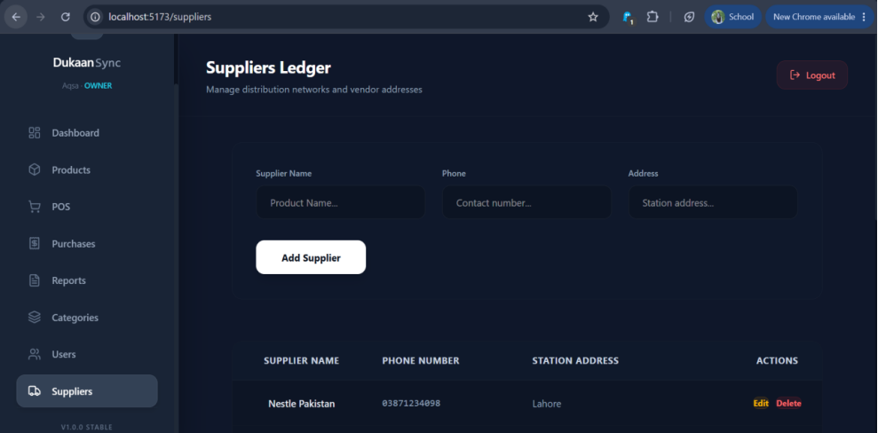
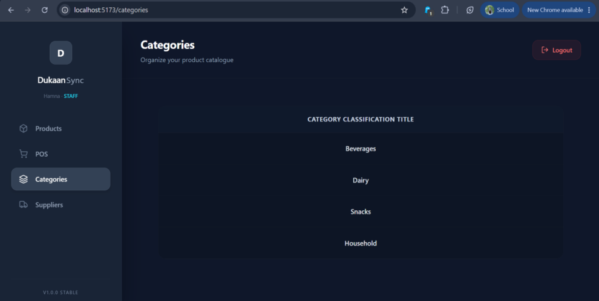

# Dukaan Sync

## Overview

Dukaan Sync is a modern Full Stack Inventory and Point of Sale (POS) Management System developed for Small & Medium-Sized Businesses.

The system helps store owners manage Products, Categories, Suppliers, Purchases, Sales, Stock Tracking, User Roles & business operations through a clean & Responsive Dashboard.

The project follows a Role-Based Access Control System where different users have different Permissions according to their Responsibilities.

---

## Features

### Authentication & Authorization

* Secure Login System
* JWT Authentication
* Role Based Access Control
* Owner, Admin and Staff Roles

### Product Management

* Add Products
* Update Products
* Delete Products
* Product Images
* SKU Management
* Cost Price & Selling Price
* Low Stock Alerts

### Category Management

* Add Categories
* Update Categories
* View Categories

### Supplier Management

* Add Suppliers
* Update Supplier Information
* Supplier Purchase Tracking

### Purchase Management

* Create Purchases
* Supplier Selection
* Product Selection
* Quantity Management
* Cost Price Tracking
* Automatic Stock Increase

### Sales / POS System

* Product Billing Interface
* Shopping Cart
* Quantity Management
* Tax Calculation
* Invoice Generation
* Automatic Stock Deduction

### Dashboard

* Total Products
* Total Sales
* Total Purchases
* Low Stock Products
* Weekly Sales Analytics

### Reports

* Business Insights
* Inventory Monitoring
* Sales Overview

---

## Technologies Used

### Frontend

* React.js
* React Router DOM
* Axios
* Tailwind CSS
* Recharts
* React Hot Toast

### Backend

* Node.js
* Express.js
* JWT Authentication
* Middleware Based Authorization

### Database

* MongoDB
* Mongoose

### Other Tools

* Git
* GitHub
* Cloudinary

---

## User Roles

### Owner

* Full System Access
* Manage Users
* Manage Products
* Manage Suppliers
* Manage Purchases
* Delete Records

### Admin

* Manage Products
* Manage Categories
* Manage Suppliers
* Manage Purchases
* Manage Sales

### Staff

* Access POS
* Create Sales
* View Assigned Data

---

## Project Structure

```text
Dukaan-Sync
│
├── Backend
│   │
│   ├── config
│   ├── controllers
│   ├── middleware
│   ├── models
│   ├── routes
│   ├── .env
│   └── server.js
│
├── Frontend
│   │
│   ├── src
│   │   ├── components
│   │   ├── pages
│   │   ├── services
│   │   ├── assets
│   │   └── App.jsx
│   │
│   └── package.json
│
├── .gitignore
└── README.md
```

---

## Main Modules

* Authentication System
* User Management
* Product Management
* Category Management
* Supplier Management
* Purchase Management
* POS Billing System
* Dashboard Analytics
* Reports Module

---

## WorkFlow Chart

## Screenshots

* Login Page


* Dashboard
![Dashboard Screenshot]!(image-3.png)

* Product Management


* POS Billing Screen


* Purchases Page


* Reports & Analytics


* Categories Registry


* Users (Staff Control Panel)


* Suppliers Ledger



* Staff Login 


---

## Installation

### Clone Repository

```bash
git clone <https://github.com/AqsaQayyum-333/Dukaan-Sync.git>
```

### Backend Setup

```bash
cd Backend
npm install
npm start
```

### Frontend Setup

```bash
cd Frontend
npm install
npm run dev
```

---

## Environment Variables

Create a .env file inside Backend folder.

```env
PORT=5000
MONGO_URI=your_mongodb_connection
JWT_SECRET=your_secret_key
CLOUDINARY_CLOUD_NAME=your_cloud_name
CLOUDINARY_API_KEY=your_api_key
CLOUDINARY_API_SECRET=your_api_secret
```

---

## Future Enhancements

* Barcode Scanner Integration
* Online Payments
* Advanced Reporting
* Export to PDF
* Multi Branch Support
* Dark / Light Theme Switching

---

## Academic Information

**Course:** Full Stack Web Development

**Instructor:** Sir Muhammad Rashaf Jamil Khan

**Program:** BS Computer Science

**Semester:** 4th Semester

**Campus:** Air University Multan Campus

---

## License

This Project is Developed for Educational & Academic Purposes as Part of the Full Stack Web Development Course.
